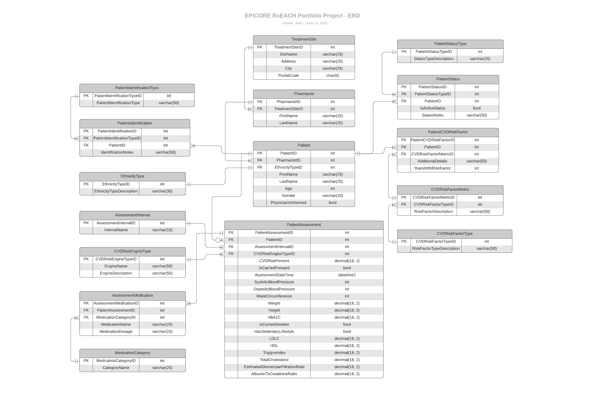

# EPICORE Centre Software Developer Job Application

## Robert Adie | Portfolio Project

## Project Outline

This portfolio project outlines one possible version of an information system that could be used to support an epidemiologic study conducted in collaboration with the EPICORE Centre. The research study used as the business case for this system is ["The Effectiveness of Pharmacist Intervention on Cardiovascular Risk: The Multicenter Randomized Controlled RxEACH Trial"](https://www.onlinejacc.org/content/67/24/2846) by Ross T. Tsuyuki, Yazid N. Al Hamarneh, Charlotte A. Jones, and Brenda R. Hemmelgarn.

Included in this project are the following sections:

1. A description of the database schema, including a ERD (Entity Relationship Diagram), Data Dictionary, and DDL (Data Definition Language) script for building the database and inserting test data.

2. A RESTful (Representational State Transfer) API project built with .NET Framework to allow for several basic CRUD (primarily Create & Read) use cases; included in this section are code excerpts and examples of successful responses to API calls. All testing is done using the Postman API testing application.

3. A brief discussion of the project.

## Part 1: Database Schema Development

### Entity Relationship Diagram

### Data Dictionary

Table Name/Row | Column Name | Constraints | Datatype | Notes
----------:|-------------|------------|----------|------
**TreatmentSite** <td colspan=3> The site (pharmacy) that the pharmacist belongs to. </td>||||
1 | TreatmentSiteID | PK | int | The unique  identifier for this table.
2 | SiteName | Not Null | varchar(25) | The name of the site (pharmacy).
3 | Address | Not Null | varchar(25) | The address of the site (pharmacy).
4 | City | Not Null | varchar(25) | The city where the site (pharmacy) is located.
5 | PostalCode | Not Null | char(6) | The postal code of the site (pharmacy).
**Pharmacist** <td colspan=4> The pharmacist providing intervention to the patient. </td>||||
1 | PharmacistID | PK | int | The unique  identifier for this table.
2 | TreatmentSiteID | FK | int | The link to the TreatmentSite record to which this pharmacist belongs.
3 | FirstName | Not Null | varchar(25) | The first name of the pharmacist.
4 | LastName | Not Null | varchar(25) | The last name of the pharmacist.
**Patient** <td colspan=4> The patient being included in the study. </td>||||
1 | PatientID | PK | int | The unique  identifier for this table.
2 | PharmacistID | FK | int | The link to the Pharmacist record to which this patient belongs.
3 | EthnicityTypeID | FK | int | The link to the EthnicityType record to which this patient belongs.
4 | FirstName | Not Null | varchar(25) | The first name of the patient.
5 | LastName | Not Null | varchar(25) | The last name of the patient.
6 | Age | Not Null | int | The age of the patient.
7 | Gender | Not Null | varchar(10) | The gender of the patient (varchar to account for non male/female options).
8 | PhysicianIsInformed | Not Null | bit | Whether the patient's physician has been informed of the intervention being conducted by the pharmacist.
**EthnicityType** <td colspan=3> The different ethnicity types that patients can be assigned to. </td>||||
**Possible Values** <td colspan=3> Caucasian/Other; African/Caribbean; Asian (oriental)/South Asian (Indian, Pakistani, Sri Lankan, Bangladesh)</td>||||
1 | EthnicityTypeID | PK | int | The unique  identifier for this table.
2 | EthnicityTypeDescription | Not Null | varchar(75) | The description of the EthnicityType.
**PatientIdentification** <td colspan=3> Represents how the patient was identified for inclusion in this study. </td>||||
1 | PatientIdentificationID | PK | int | The unique  identifier for this table.
2 | PatientIdentificationTypeID | FK | int | The link to the PatientIdentificationType parent record.
3 | PatientID | FK | int | The link to the Patient parent record.
4 | IdentificationNotes | Null | varchar(50) | Any additional notes required to adequately describe how the patient was identified for inclusion in the study.
**PatientIdentificationType** <td colspan=3> Represents the different identification types that exist for recruiting patients. </td>||||
**Possible Values** <td colspan=3> Receiving metformin (marker for type 2 diabetes); Receiving clopidogrel or acetylsalicylic acid(for coronary artery disease); Receiving antihypertensive agents; Receiving statins (dyslipidemic patients); Known smoker; Newspaper; Other advertising; Pharmacy heart health clinic</td>||||
1 | PatientIdentificationTypeID | PK | int | The unique  identifier for this table.
2 | PatientIdentificationType | Not Null | varchar(75) | The method of identifying a patient.
**PatientStatus** <td colspan=3> The status of the patient within the study. </td>||||
1 | PatientStatusID | PK | int | The unique  identifier for this table.
2 | PatientStatusTypeID | FK | int | The link to the PatientStatusType record that applies to this patient's status.
3 | PatientID | FK | int | The link to the Patient record to which this patient status belongs.
4 | IsActiveStatus | not null | bit | Whether this status record is the active one (patients can have multiple status records, the latest of which will supersede the others).
5 | StatusNotes | null | varchar(50) | Any notes to further elaborate on why the status of the patient was changed.
**PatientStatusType** <td colspan=3> The different statuses that patients can have within a study. </td>||||
**Possible Values (Rejected)** <td colspan=3> Didn't meet inclusion criteria; Declined to participate; Other; Unconsenting; Unable to follow up; Pregnant </td>||||
**Possible Values (Accepted)** <td colspan=3> Accepted (if accepted before randomization); Usual Care; Intervention (accepted but after randomization) </td>||||
**Possible Values (Lost During Follow Up)** <td colspan=3> Lost to follow up; Withdrew consent; Moved away </td>||||
1 | PatientStatusTypeID | PK | int | The unique  identifier for this table.
2 | StatusTypeDescription | Not Null | varchar(50) | Text describing the patient statuse.
**PatientCVDRiskFactor** <td colspan=3> A record indicating a risk factor for CVD that the patient has upon inclusion in the study. </td>||||
1 | PatientCVDRiskFactorID | PK | int | The unique  identifier for this table.
2 | PatientID | FK | int | The link to the Patient record to which this risk factor record belongs.
3 | CVDRiskFactorMetricID | FK | int | The link to the CVDRiskFactorMetric record to which this risk factor record belongs.
4 | AdditionalDetails | Null | varchar(50) | Any additional information pertaining to this CVD risk factor not accounted for by the description.
5 | YearsWithRiskFactor | Null | int | The number of years that the patient has had this risk factor for (nullable in case multiple factors option selected).
**CVDRiskFactorMetric** <td colspan=3> A record indicating what measurement is used to determine the patient's risk factor. </td>||||
**Possible Values (Diabetes)** <td colspan=3>Type 1 diabetes; Type 2 diabetes</td>||||
**Possible Values (Chronic Kidney Disease)** <td colspan=3>Estimated glomerular filtration rate of <60 ml/min/1.73 m2 on 2 consecutive measurements within a 3-month period; Albumin-to-creatinine ratio ≥30 in a single measurement or between 3 and 29 on 2 consecutive measurements within a 3-month period</td>||||
**Possible Values (Atherosclerotic Vascular Disease)** <td colspan=3>Cerebrovascular Disease - prior stroke or transient ischemic attack; CoronaryArteryDisease - myocardial infarction, acute coronary syndrome, stable angina, or revascularization; Peripheral Arterial Disease - symptomatic and/or ankle brachial index < 0.9</td>||||
**Possible Values (Multiple Factors)** <td colspan=3>Framingham Score - primary prevention patient with multiple risk factors and Framingham risk score > 20%</td>||||
**Possible Values (Uncontrolled Risk Factor)** <td colspan=3>Blood pressure > 140/90 or > 130/80 mm Hg if diabetic; Low-density lipoprotein cholesterol (LDL-C) >2.0 mmol/l; HbA1c > 7.0%; Current smoker; Currently leads a sedentary lifestyle</td>||||
1 | CVDRiskFactorMetricID | PK | int | The unique  identifier for this table.
2 | CVDRiskFactorTypeID | FK | int | The link to the CVDRiskFactorType record to which this risk factor metric record belongs.
3 | RiskFactorDescription | Not Null | varchar(200) | The description of the risk factor metric.
**CVDRiskFactorType** <td colspan=3> A record describing the parent type that a CVDRiskFactorMetric belongs to. </td>||||
**Possible Values** <td colspan=3>Diabetes; Chronic Kidney Disease; Atherosclerotic Vascular Disease; Multiple Factors Present; Uncontrolled Risk Factor</td>||||
1 | CVDRiskFactorTypeID | PK | int | The unique  identifier for this table.
2 | RiskFactorTypeDescription | Not Null | varchar(50) | The description of the risk factor type.
**PatientAssessment** <td colspan=3> A record of an assessment conducted by a pharmacist with a patient receiving intervention care. </td>||||
1 | PatientAssessmentID | PK | int | The unique  identifier for this table.
2 | PatientID | FK | int | The link to the patient record related to this assessment.
3 | AssessmentIntervalID | FK | int | The link to the AssessmentInterval record that applies to this assessment (indicates whether this is a baseline assessment or a follow up assessment at the 1, 2, or 3 month mark).
4 | CVDRiskEngineTypeID | FK | int | The link to the CVDRiskEngineType record that describes the risk engine being used to calculate the CVD risk for the patient at the time of this assessment.
5 | CVDRiskPercent | Not Null | decimal(18, 2) | The risk calculation as a percentage derived based on the risk engine most appropriate for this patient during this assessment.
6 | IsCarriedForward | Not Null | bit | Whether this assessment is carried forward from the previous one conducted due to an inability of the patient to follow up (**note: add a constraint to the database to ensure this is always false during an initial assessment**).
7 | AssessmentDateTime | Not Null | datetime2 | The date and time on which this assessment was conducted.
8 | SystolicBloodPressure | Not Null | int | The patient's systolic blood pressure at this assessment.
9 | DiastolicBloodPressure | Not Null | int | The patient's diastolic blood pressure at this assessment.
10 | WaistCircumference | Not Null | int | The waist circumference of the patient at this assessment in cm.
11 | Weight | Not Null | decimal(18, 2) | The weight of the patient at this assessment in kg.
12 | Height | Not Null | decimal(18, 2) | The height of the patient at this assessment in cm.
13 | HbA1C | Not Null | decimal(18, 2) | The HbA1c of the patient at this assessment.
14 | IsCurrentSmoker | Not Null | bit | Whether the patient is a current smoker at this assessment.
15 | HasSedentaryLifestyle | Not Null | bit | Whether the patient self-identifies as leading a sedentary lifestyle at this assessment.
16 | LDLC | Not Null | decimal(18, 2) | The patient's low density lipoprotein amount at this assessment.
17 | HDL | Not Null | decimal(18, 2) | The patient's high density lipoprotein amount at this assessment.
18 | Triglycerides | Not Null | decimal(18, 2) | The patient's triglyceride amount at this assessment.
19 | TotalCholesterol | Not Null | decimal(18, 2) | The patient's total cholesterol amount at this assessment.
20 | EstimatedGlomularFiltrationRate | Not Null | decimal(18, 2) | The patient's estimated glomular filtration rate at this assessment.
21 | AlbuminToCreatinineRatio | Not Null | decimal(18, 2) | The patient's albumin to creatinine ratio at this assessment.
**AssessmentInterval** <td colspan=3> The interval values at which a patient assessment can take place. </td>||||
**Possible Values** <td colspan=3>Baseline; 1 month; 2 months; 3 months</td>||||
1 | AssessmentIntervalID | PK | int | The unique  identifier for this table.
2 | IntervalName | Not Null | varchar(10) | The assessment interval descriptor.
**CVDRiskEngineType** <td colspan=3> The CVD risk engine used to determine a patient's CVD risk at the time of their assessment. </td>||||
**Possible Values** <td colspan=3>The United Kingdom Prospective Diabetes Study - For diabetics; The International model for prediction of recurrent CVD - For those with previous vascular disease; The Framingham Risk Score - For patients with CKD or primary prevention patients at high risk for cardiovascular events; **Note: When patients have > 1 comorbidity, the risk engine estimating the highest risk should be used.**</td>||||
1 | CVDRiskEngineTypeID | PK | int | The unique  identifier for this table.
2 | EngineName | Not Null | varchar(100) | The name of the risk engine.
3 | EngineDescription | Not Null | varchar(100) | A description of the risk engine.
**AssessmentMedication** <td colspan=3> A record of a medication that a patient is on at the time of the assessment. </td>||||
1 | AssessmentMedicationID | PK | int | The unique  identifier for this table.
2 | PatientAssessmentID | FK | int | The link to the parent PatientAssessment record.
3 | MedicationCategoryID | FK | int | The link to the parent MedicationCategory record.
4 | MedicationName | Not Null | varchar(25) | The name of the medication.
5 | MedicationDosage | Not Null | varchar(25) | The dosage of the medication.
**MedicationCategory** <td colspan=3> The category that a medication record belongs to. </td>||||
**Possible Values** <td colspan=3> Hypoglycemic Medication; Hypertension Medication; Dyslipidemia Medication </td>||||
1 | MedicationCategoryID | PK | int | The unique  identifier for this table.
2 | CategoryName | Not Null | varchar(25) | The name of this category of medications.

### Database Scripts

The Data Definition Language (DDL) SQL script related to implementing the aforementioned schema (and inputting static test data based upon it) can be found in the db-files folder of the repository.

## RESTful API Service

### Project Structure

The API application can be found in the api-project folder. It contains a Visual Studio 2019 solution file with 3 embedded projects: a .NET Framework Web API project called WebAPI, a class library containing data objects used throughout the project called WebAPI.Model, and a class library containing data access-related objects called WebAPI.DataAccess.

Firstly, the WebAPI project contains the controller classes that set the API URL parameters and enforce business logic. Secondly, the WebAPI.Model project contains an APIResponse object that is used to return custom API response parameters with each API call, a Models folder with all database model classes (derived from the database using Entity Framework), and a ViewModels folder with all custom data objects (including POCOs and DTOs) used within the API calls themselves. Finally, the WebAPI.DataAccess project contains the DAL (Data Access Layer) folder with a context class (necessary to make calls to the database), the Handlers folder with a class to act as an intermediary between the controller and database operations, and the DBTasks class, which is responsible for interacting with the database directly through LINQ queries.

The project structure can be summarized as follows:
- Controller classes make calls to handler methods; 
- Handler methods make calls to DBTasks methods; and
- DBTasks methods interact with the database.

The following will show some excerpts of the code used to interact with the database, with an emphasis on Create and Read (i.e., Post and Get) methods to allow for brevity.

### Project Excerpt: Create (Post)

- The create method is called as an asynchronous task to optimize software performance.
- There is 1 read method (GetPatientParams()) that returns the parameters necessary for a user to create a Patient record (all of the pharmacist and ethnicity information to fill out the relevant drop down menus).
- The following controller method is called by the API:

        APIResponse<PostResponseVM> response = new APIResponse<PostResponseVM>();

        PatientsHandler handler = new PatientsHandler();
        response = await handler.AddPatient(newPatient);

        return Ok(response);

- The following is the handler method called by the controller:

        APIResponse<PostResponseVM> response = new APIResponse<PostResponseVM>();
        try
        {
            DBTasks tasks = new DBTasks();
            response = await tasks.AddPatient(newPatient);
        }
        catch (Exception ex)
        {
            response.Messages.Add(new Message()
            {
                MessageCode = "AP001",
                MessageSeverity = MessageSeverity.Error,
                MessageText = ex.InnerException.Message
            });
        }

        return response;

- Finally, the following is the DBTasks method called by the handler (including LINQ queries):

        APIResponse<PostResponseVM> response = new APIResponse<PostResponseVM>();

        using (var context = new EPPContext())
        {
            Patient patientToAdd = new Patient();

            var validPharmIds = (from pharms in context.Pharmacists
                                    select pharms.PharmacistID).ToList();

            if (!validPharmIds.Contains(newPatient.PharmacistID))
            {
                response.Messages.Add(new Message()
                {
                    MessageCode = "AP001",
                    MessageSeverity = MessageSeverity.Error,
                    MessageText = "Please submit a valid pharmacist id to add a patient."
                });
            }
            else
            {
                patientToAdd.PharmacistID = newPatient.PharmacistID;
            }

            var validEthnicityIds = (from ethns in context.EthnicityTypes
                                        select ethns.EthnicityTypeID).ToList();

            if (!validEthnicityIds.Contains(newPatient.EthnicityTypeID))
            {
                response.Messages.Add(new Message()
                {
                    MessageCode = "AP002",
                    MessageSeverity = MessageSeverity.Error,
                    MessageText = "Please submit a valid ethnicity id to add a patient."
                });
            }
            else
            {
                patientToAdd.EthnicityTypeID = newPatient.EthnicityTypeID;
            }

            if (response.Messages.Count() == 0)
            {
                patientToAdd.FirstName = newPatient.FirstName;
                patientToAdd.LastName = newPatient.LastName;
                patientToAdd.Age = newPatient.Age;
                patientToAdd.Gender = newPatient.Gender;
                patientToAdd.PhysicianIsInformed = newPatient.PhysicianIsInformed;

                context.Patients.Add(newPatient);
                await context.SaveChangesAsync();

                PostResponseVM responseObj = new PostResponseVM
                {
                    NewRecordId = newPatient.PatientID,
                    ResponseMessage = "Patient added successfully."
                };

                response.Response = responseObj;
            }
            
        }

        return response;

- To create a record, submit the following URL and JSON data (within the request body) respectively:

        http://localhost:51368/api/addpatient

        {
            "PharmacistID": "1",
            "EthnicityTypeID": "1",
            "FirstName": "Bill",
            "LastName": "Patient",
            "Age": "67",
            "Gender": "Male",
            "PhysicianIsInformed": "true"
        }

- If successful, the following custom JSON object will be returned (derived from the APIResponse class):

        {
            "Messages": [],
            "ApiVersionNumber": "1.0.0.0",
            "Response": {
                "NewRecordId": 9,
                "ResponseMessage": "Patient added successfully."
            },
            "IsSuccess": true
        }

### Project Excerpt: Read (Get)

- This read operation returns a List\<T\> where T is a custom PatientVM object.
- The Get controller class contains the following:

        APIResponse<List<PatientVM>> response = new APIResponse<List<PatientVM>>();
            
        PatientsHandler handler = new PatientsHandler();
        response = handler.GetPatients();

        return Ok(response);

- The handler method called above contains the following:

        APIResponse<List<PatientVM>> response = new APIResponse<List<PatientVM>>();
        try
        {
            DBTasks tasks = new DBTasks();
            response = tasks.GetPatients();
        }
        catch (Exception ex)
        {
            response.Messages.Add(new Message()
            {
                MessageCode = "GP001",
                MessageSeverity = MessageSeverity.Error,
                MessageText = ex.InnerException.Message
            });
        }

        return response;

- And finally, the DBTasks method called above contains the following:

        APIResponse<List<PatientVM>> response = new APIResponse<List<PatientVM>>();
        using (var context = new EPPContext())
        {
            var patients = (from patient in context.Patients
                            select new PatientVM
                            {
                                FirstName = patient.FirstName,
                                LastName = patient.LastName,
                                Age = patient.Age,
                                Gender = patient.Gender,
                                PhysicianIsInformed = patient.PhysicianIsInformed,
                                Ethnicity = (from ethnicity in context.EthnicityTypes
                                            where ethnicity.EthnicityTypeID == patient.EthnicityTypeID
                                            select ethnicity.EthnicityTypeDescription).FirstOrDefault(),
                                Pharmacist = (from pharmacist in context.Pharmacists
                                                where pharmacist.PharmacistID == patient.PharmacistID
                                                select pharmacist.LastName + ", " + pharmacist.FirstName).FirstOrDefault()
                            }).ToList();

            if (patients == null || patients.Count() == 0)
            {
                response.Messages.Add(new Message()
                {
                    MessageCode = "GP001",
                    MessageSeverity = MessageSeverity.Warning,
                    MessageText = "Sorry, there are no patients to display."
                });
            }
            else
            {
                response.Response = patients;
            }
        }

        return response;

- To submit the request, enter the following URL:

        http://localhost:51368/api/getpatients

- If successful, the following JSON data will be returned (again, from the custom APIResponse object):

        {
            "Messages": [],
            "ApiVersionNumber": "1.0.0.0",
            "Response": [
                {
                    "FirstName": "Joe",
                    "LastName": "Patient",
                    "Age": 65,
                    "Gender": "Male",
                    "PhysicianIsInformed": true,
                    "Ethnicity": "Caucasian/Other",
                    "Pharmacist": "One, Pharmacist"
                },
                {
                    "FirstName": "Bob",
                    "LastName": "Patient",
                    "Age": 65,
                    "Gender": "Male",
                    "PhysicianIsInformed": true,
                    "Ethnicity": "Caucasian/Other",
                    "Pharmacist": "One, Pharmacist"
                },
                {
                    "FirstName": "Frank",
                    "LastName": "Patient",
                    "Age": 65,
                    "Gender": "Male",
                    "PhysicianIsInformed": true,
                    "Ethnicity": "Caucasian/Other",
                    "Pharmacist": "One, Pharmacist"
                },
                {
                    "FirstName": "Jack",
                    "LastName": "Patient",
                    "Age": 65,
                    "Gender": "Male",
                    "PhysicianIsInformed": true,
                    "Ethnicity": "Caucasian/Other",
                    "Pharmacist": "One, Pharmacist"
                },
                {
                    "FirstName": "Liz",
                    "LastName": "Patient",
                    "Age": 65,
                    "Gender": "Female",
                    "PhysicianIsInformed": true,
                    "Ethnicity": "Caucasian/Other",
                    "Pharmacist": "One, Pharmacist"
                },
                {
                    "FirstName": "Fran",
                    "LastName": "Patient",
                    "Age": 65,
                    "Gender": "Female",
                    "PhysicianIsInformed": true,
                    "Ethnicity": "Caucasian/Other",
                    "Pharmacist": "One, Pharmacist"
                },
                {
                    "FirstName": "Gerty",
                    "LastName": "Patient",
                    "Age": 65,
                    "Gender": "Female",
                    "PhysicianIsInformed": true,
                    "Ethnicity": "Caucasian/Other",
                    "Pharmacist": "One, Pharmacist"
                },
                {
                    "FirstName": "Barb",
                    "LastName": "Patient",
                    "Age": 65,
                    "Gender": "Female",
                    "PhysicianIsInformed": true,
                    "Ethnicity": "Caucasian/Other",
                    "Pharmacist": "One, Pharmacist"
                },
                {
                    "FirstName": "Bill",
                    "LastName": "Patient",
                    "Age": 67,
                    "Gender": "Male",
                    "PhysicianIsInformed": true,
                    "Ethnicity": "Caucasian/Other",
                    "Pharmacist": "One, Pharmacist"
                }
            ],
            "IsSuccess": true
        }

## Project Limitations

1. Due to time constraints, a client-facing application and all requisite Update and Delete (Put and Delete) methods were ommitted. I emphasized the Get, Post, and database schema/DDL portions of the project due to their relative importance, as well as their greater relevance to the job description.

2. In the patient assessment table, many of the measurements only have units specified in the data dictionary notes. If multiple measurement types were to be used, it would be advisable to abstract all values (for example, waist circumference, height, weight, etc.) into their own tables so as to allow for metric and US Customary variance (e.g., height in cm or inches).

## Conclusions

I'm extremely excited by the important work the EPICORE Centre is doing, both to help enable pharmacists to play a more pronounced role in treating chronic disease and doing vital pharmaceutical research more broadly. I would love to be a part of your work in any way that I can and I really appreciate you taking the time to speak with me. Thanks very much for reading this project portfolio summary and I look forward to hearing from you soon.
